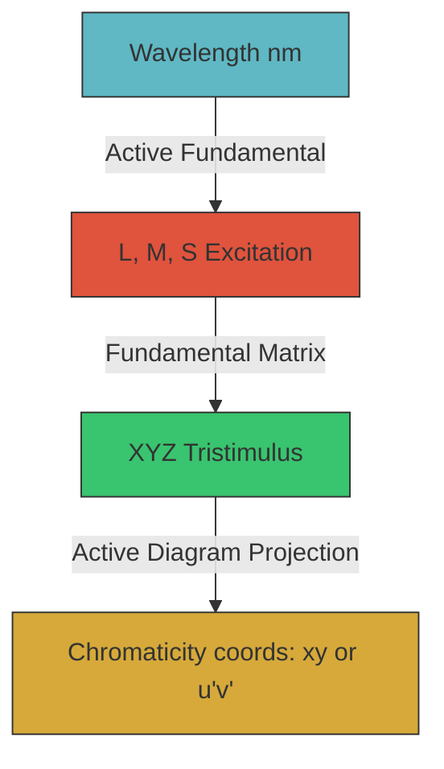

# Specification & Plan: Modular LMS Cone Fundamentals & Chromaticity Diagrams

This specification outlines the modularization of **LMS Cone Fundamentals** and the implementation of **Multiple Chromaticity Diagrams** in COLOR LAB. It replaces the current analytical wavelength fits with reference observer data as the source of truth, maps the user's custom curve to its experimental origins, and details the impact on active and planned color pipelines.

---

## 1. Current State & Problem Analysis

In the current codebase, the relationship between visible wavelengths, LMS cone sensitivities, and CIE XYZ coordinates is tightly coupled and rigid:
- **Tails Instability**: [`pipeline.ts`](file:///home/ushif/repos/colorlab/fe/src/lib/color/pipeline.ts#L154-L181) implements the L, M, and S cone sensitivities using a custom sum of Gaussians and Gaussian-derivatives. While this fit matches the Stockman & Sharpe (2000) experimental data well in the core visible spectrum, the polynomial derivative terms cause the curve to oscillate or diverge outside the `[402, 682]` nm range.
- **Locus Artifacts**: Because the locus curve in [`xy-panel.ts`](file:///home/ushif/repos/colorlab/fe/src/lib/panels/xy-panel.ts#L23-L27) is drawn by sampling `waveToXyz(nm)` at the edges of the spectrum, the unstable tails of the fits produce looping, curling, or diverging artifacts on the canvas.
- **Single Observer Space**: The app assumes a single observer model (Stockman & Sharpe 2000) projected via a constant matrix (`LMS2XYZ2`) into the standard **CIE 1931 2°** chromaticity diagram. For scientific analysis, mixing the 1931 observer diagram coordinates with 2006 physiological LMS curves introduces a geometric mismatch.

---

## 2. Proposed Architecture

We propose introducing two modular registries under `fe/src/lib/color/`:
1. **LMS Fundamentals Registry (`fundamentals.ts`)**: Represents the physical/biological sensitivity of human cones.
2. **Chromaticity Diagrams Registry (`diagrams.ts`)**: Represents the projection spaces used to map spectral and source colors onto 2D planes.



---

## 3. Modular Registries Specification

### A. LMS Cone Fundamentals (`fe/src/lib/color/fundamentals.ts`)
Each fundamental model will define:
- `key`: Unique identifier (e.g., `'stockman-sharpe-2deg'`, `'smith-pokorny'`).
- `label`: Human-readable name (e.g., `"Stockman & Sharpe (2000) 2°"`).
- `wavelengthRange`: Stable boundaries (e.g., `[380, 780]` nm).
- `evaluate(nm)`: Returns the `[L, M, S]` excitation values.
- `toXyzMatrix`: The canonical $3\times3$ transformation matrix mapping this model's LMS values to its associated XYZ space.

#### Available Models:
1. **Stockman & Sharpe (2000) 2°**: Industry standard for physiological colorimetry (basis of CIE 2006).
2. **Stockman & Sharpe (2000) 10°**: Large-field physiological model.
3. **Smith & Pokorny (1975)**: Derived from the Judd-modified CIE 1931 CMFs.

#### Reference-Validated Evaluator Requirement
The first implementation must not hide the current edge artifacts by clamping,
windowing, or otherwise cosmetically stabilizing an evaluator that is wrong at
the edges. Range extremes are colorimetrically meaningful for spectral locus and
observer work, so the evaluator must be validated against authoritative
measured/tabulated data across the full visible range.

Recommended approach:

- Use CVRL / CIE-published table data for the selected observer model at the
  finest practical wavelength interval available as the benchmark.
- Evaluate both table-based interpolation and continuous analytical fits against
  that benchmark. A good continuous fit can be preferable between tabulated
  samples if its error is lower than interpolation and it behaves correctly at
  the extremes.
- For interpolation, prefer monotone or shape-preserving methods where possible.
  Natural cubic splines are acceptable only if they do not overshoot low-energy
  tails or create negative lobes.
- For analytical fits, require explicit error thresholds, correct non-negative
  tail behavior, and no oscillation/divergence outside the fitted core range.
- Keep the current analytical fit as a candidate/comparison fixture. If it is
  within acceptable error over a documented subrange, keep using it there and
  replace only the failing region with a better reference-validated evaluator.

### B. Chromaticity Diagrams (`fe/src/lib/color/diagrams.ts`)
Each diagram defines:
- `key`: Unique identifier (e.g., `'cie1931'`, `'cie1976'`, `'cie2006'`).
- `label`: Human-readable title (e.g., `"CIE 1976 UCS (u', v')"`).
- `project(xyz)`: Maps `[X, Y, Z]` to 2D coordinates `[u, v]`.
- `locusBoundary()`: Pre-calculated or sampled 2D polygon of the spectral locus.

#### Available Diagrams:
1. **CIE 1931 2° $(x, y)$**: The standard Guild-Wright chromaticity diagram.
2. **CIE 1964 10° $(x_{10}, y_{10})$**: Large-field chromaticity.
3. **CIE 1976 UCS $(u', v')$**: Perceptually uniform chromaticity.
4. **CIE 2006 Physiological $(x_F, y_F)$**: Aligned directly with Stockman & Sharpe cone CMFs.

---

## 4. Roadmap Integration & Ownership

```
                          ┌──────────────────────────┐
                          │  Color / Observer Context│
                          │   - activeGamut          │
                          │   - displayGamutProfile  │
                          │   - observerModel        │
                          │   - chromaticityDiagram  │
                          └─────────────┬────────────┘
                                        │
                                        ▼
                          ┌──────────────────────────┐
                          │     rebuildMatrices      │
                          │  - Derived matrices for  │
                          │    RGB ↔ LMS ↔ XYZ ↔ Ok  │
                          └─────────────┬────────────┘
                                        │
                 ┌──────────────────────┴──────────────────────┐
                 ▼                                             ▼
     ┌──────────────────────┐                       ┌──────────────────────┐
     │    WebGL Shaders     │                       │    CVD Simulation    │
     │  - uRgb2Lms          │                       │  - uses RGB2LMS &    │
     │  - uLms2Rgb          │                       │    LMS2RGB           │
     └──────────────────────┘                       └──────────────────────┘
```

Observer and chromaticity settings are **not theme settings** and should not be
owned by the ramp pipeline. They belong with the broader Color Context work:

- **Active gamut**: working/export intent and Explorer solid.
- **World space**: Explorer geometry/interpolation coordinate system.
- **Display gamut**: physical monitor/profile preference.
- **Observer model / LMS fundamentals**: spectral-to-LMS/XYZ reference used by
  cone panels, spectral locus, CVD math, and future scientific reference views.
- **Chromaticity diagram**: projection/view of tristimulus data used by
  instruments and overlays.

This means the UI should not introduce a ramp-local or theme-local
`activeLmsModel`. The first durable home should be either:

1. a global **Color Context** advanced section, if the observer choice affects
   document interpretation, CVD matrices, or shared spectral overlays; or
2. the Explorer/Inspector reference controls, if the setting only changes a
   local diagram projection.

Recommended split:

- `observerModel`: document-level only once it affects saved analysis or CVD
  behavior. Until then, keep it fixed at the current default and move that
  default onto reference data internally.
- `chromaticityDiagram`: local UI preference if it only changes the xy/u'v'
  instrument view; document-level only if diagram selection becomes semantic
  for picking, saved annotations, or exported analysis.

### Sequencing with the Current Roadmap

1. **Reference-validated evaluator work can ship first without a schema bump.**
   Replacing or segmenting the unstable analytical evaluator behind the current
   default observer is a correctness fix for existing behavior. The replacement
   may be table-interpolated or analytical, but it must be benchmarked against
   reference data and preserve colorimetric outputs at range extremes rather
   than merely suppress visible artifacts.
2. **Chromatic adaptation should precede exposed observer/profile choices.**
   The same shared `DerivedMatrices` path should carry white-point adaptation
   and observer/display matrices so CPU, GPU, picking, and panels agree.
3. **Display gamut preferences should share the Color Context surface.** The
   observer selector, display profile summary, and Active-vs-Display warnings
   should read as one colorimetric context rather than separate Explorer knobs.
4. **Direct xy/chromaticity picking depends on this work.** Once multiple
   diagrams exist, picking must specify the held luminance/lightness and the
   diagram/observer used to invert the point.
5. **CVD parity is a gate for exposing LMS choices.** A selectable observer is
   misleading unless viewport, inspector panels, and ramp previews use matching
   LMS/CVD transforms.

## 5. Pipeline & System Integration Impact

### A. CVD Simulation (`cvd.ts`)
The CVD simulation is performed by projecting RGB colors into the LMS color space, applying a dichromatic projection matrix (collapsing L, M, or S along its copunctal axis), and projecting back to RGB.
- **Impact**: The projection matrices in [`cvd.ts`](file:///home/ushif/repos/colorlab/fe/src/lib/color/cvd.ts#L6-L11) are derived specifically for a particular LMS space (originally Stockman-Sharpe).
- **Resolution**: When a user changes the active LMS model, we must dynamically compute the appropriate CVD projection matrices from the copunctal points of the selected observer, or scale the conversion based on the active fundamental.

### B. WebGL Renderer (`webgl-renderer.ts` & Shaders)
- **Impact**: The solid rendering fragment shader [`solid.frag`](file:///home/ushif/repos/colorlab/fe/src/lib/renderer/shaders/solid.frag#L9) performs CVD simulation on the GPU using uniform matrices `uRgb2Lms` and `uLms2Rgb`.
- **Resolution**: The shader code itself does not need modification. The JS uniform builder in `rebuildMatrices` will dynamically compute and supply the matching matrices for the active LMS model.

### C. 3D Viewport Geometry & Morphing
- **Impact**: Viewport aids, spectrum locus lines, and chromaticity projections within the 3D volume depend on the active CMF mapping.
- **Resolution**: All 3D coordinate morphing paths in [`uniforms.ts`](file:///home/ushif/repos/colorlab/fe/src/lib/renderer/uniforms.ts) will consume the active CMF to generate consistent meshes.

### D. Document Persistence
- **Impact**: Exposing user-selectable observer/diagram settings may require
  persistence, but only after deciding whether each setting is document semantic
  or local preference.
- **Resolution**: Do **not** bump the schema for evaluator replacement while the
  selected observer identity stays the same. If a later phase persists
  document-level observer choices, store them under the
  global color/observer context, not `theme`, and then follow the document
  persistence playbook with an explicit migration.

---

## 6. Detailed Implementation Plan

### Phase 1: Reference Data & Fit Audit
1. Write a scratch script under `fe/src/lib/color/scratch/compare-fundamentals.ts` to load CVRL/CIE reference datasets.
2. Compare the current Gaussian-derivative formula from `pipeline.ts` against the relevant reference data to identify its closest source model and quantify errors across the full visible range, with special attention to the low-energy tails.
3. Select the reference dataset that should define the current default observer. Prefer newer physiological observer measurements where they match the intended model; document any mismatch with CIE 1931/1964 diagram geometry.
4. Compare evaluator strategies:
   - current analytical fit over any range where it remains accurate;
   - shape-preserving interpolation from reference samples;
   - continuous analytical alternatives or segmented fits.
5. Implement the default evaluator from the strategy with the best documented accuracy/behavior tradeoff. Reject interpolation or analytical methods that overshoot, go negative, oscillate, diverge, or distort spectral-locus extremes.
6. Keep this phase UI-free and persistence-free: it changes the numeric evaluator for the same observer identity, not the saved document shape.

### Phase 2: Registry & Mathematical Foundation
1. Implement `fe/src/lib/color/fundamentals.ts` containing:
   - Reference-validated evaluators for Stockman-Sharpe 2°/10° and Smith-Pokorny 2°.
   - Matrices for LMS $\leftrightarrow$ XYZ mapping.
2. Implement `fe/src/lib/color/diagrams.ts` containing the coordinate projection math for CIE 1931 xy, CIE 1976 UCS u'v', and CIE 2006 xy.
3. Keep the selected default observer identity unchanged until CVD and panel
   parity are ready, but preserve only evaluator segments that meet the
   documented reference-data error and tail-behavior criteria.

### Phase 3: WebGL & CVD Updates
1. Modify `rebuildMatrices` in `fe/src/lib/renderer/uniforms.ts` to compute `RGB2LMS` and `LMS2RGB` dynamically using the active LMS model.
2. Update [`cvd.ts`](file:///home/ushif/repos/colorlab/fe/src/lib/color/cvd.ts) to calculate/fetch CVD matrices corresponding to the active observer.
3. Ensure the same observer path feeds viewport CVD, inspector panels, and ramp
   previews before exposing the selector.

### Phase 4: Instrument Panels & UI Integration
1. Update [`cones-panel.ts`](file:///home/ushif/repos/colorlab/fe/src/lib/panels/cones-panel.ts) to render the active fundamental.
2. Update [`xy-panel.ts`](file:///home/ushif/repos/colorlab/fe/src/lib/panels/xy-panel.ts) to draw the active diagram coordinates and locus line dynamically.
3. Add chromaticity-diagram selection to the Explorer Reference / instrument
   controls if it is local to visualization.
4. Add observer-model selection only in the global Color Context advanced area
   once it is colorimetrically consistent across CVD, panels, overlays, and
   picking.

### Phase 5: Persistence & Testing
1. If observer model becomes document-level, update `types.ts`,
   `state.svelte.ts`, `snapshot.ts`, and `schema.ts` together and add the
   required migration/tests.
2. If chromaticity diagram is only a panel preference, persist it with app
   preferences / session state instead of document snapshots.
3. Write unit tests in `parse.test.ts`, color math tests, and panel projection
   tests validating clean migrations, matrix recalculation, and stable spectral
   locus boundaries.
