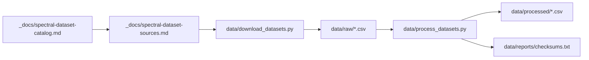

# Spectral Dataset Download Sources

Status: verified source inventory (2026-06-09).

Companion to [`spectral-dataset-catalog.md`](spectral-dataset-catalog.md) (what datasets the
registry needs) and [`lms-fundamentals-chromaticity-plan.md`](lms-fundamentals-chromaticity-plan.md)
(how they are used). This document records **concrete, tested download URLs** and compares
them with what is already present under [`data/`](../data/).

All CVRL and CIE URLs below were probed in-session (HTTP 200, non-trivial payload) unless
marked **no download**.

---

## Primary hosts

| Host | Index | Transport |
|------|-------|-----------|
| **CIE open data** | https://cie.co.at/data-tables | Direct GET → `https://files.cie.co.at/<file>.csv` |
| **CVRL (UCL)** | http://www.cvrl.org/main.php | POST forms (landing pages per family) |

**CVRL POST examples:**

```bash
# CMFs
curl -sL -X POST -d "whichfile=ciexyz31_1.csv" \
  http://www.cvrl.org/offercsvcmfs.php -o ciexyz31_1nm.csv

# Cone fundamentals (Stockman & Sharpe 2°)
curl -sL -X POST -d "Cone_units=energy&Cone_steps=1&Cone_format=csv" \
  http://www.cvrl.org/conerequest_ss2.php -o ss2deg_1nm.csv

# Luminous efficiency (physiological 2°)
curl -sL -X POST -d "Lum_units=energy&Lum_steps=1&Lum_format=csv" \
  http://www.cvrl.org/lumrequest_2.php -o lum2deg_1nm.csv
```

**Automation in repo:** [`data/download_datasets.py`](../data/download_datasets.py) fetches
all verified CSV/XLS sources below; [`data/process_datasets.py`](../data/process_datasets.py)
normalizes CSV headers into `data/processed/` and writes SHA-256 checksums to
`data/reports/checksums.txt`.

Run from repo root:

```bash
python3 data/download_datasets.py
python3 data/process_datasets.py
```

---

## Current `data/` inventory vs catalog

### Files on disk (2026-06-09, gap-fill complete)

`data/raw/` holds **42 CSV** + **2 Excel** files; `data/processed/` mirrors all CSVs with
canonical headers. Checksums: [`data/reports/checksums.txt`](../data/reports/checksums.txt)
(42 entries).

| Local file | Catalog dataset | Source |
|------------|-----------------|--------|
| `ciexyz31_1nm.csv` | CIE 1931 XYZ CMFs 2° | CVRL `ciexyz31_1.csv` (matches committed; CIE GET is equivalent numerically) |
| `ciexyz64_1nm.csv` | CIE 1964 XYZ CMFs 10° | CIE `CIE_xyz_1964_10deg.csv` |
| `ciexyzj_5nm.csv` | Judd 1951 modified CIE 1931 | CVRL `ciexyzj.csv` |
| `ciexyzjv_5nm.csv` | Judd–Vos 1978 modified CIE 1931 | CVRL `ciexyzjv.csv` |
| `ciexyz2006_2deg_1nm.csv` | CIE 2006 XYZ_F CMFs 2° | CIE `CIE_cfb_stv_2deg.csv` |
| `ciexyz2006_10deg_1nm.csv` | CIE 2006 XYZ_F CMFs 10° | CIE `CIE_cfb_stv_10deg.csv` |
| `ciexyz2006_2deg_01nm.csv` | CIE 2006 XYZ_F CMFs 2° (0.1 nm) | CVRL `xyzcmfrequest_2.php`, `xyz_steps=fine` |
| `ciexyz2006_10deg_01nm.csv` | CIE 2006 XYZ_F CMFs 10° (0.1 nm) | CVRL `xyzcmfrequest_10.php`, `xyz_steps=fine` |
| `ciexy31_1nm.csv` | CIE 1931 xy spectral locus | CIE `CIE_cc_1931_2deg.csv` |
| `ciexy64_1nm.csv` | CIE 1964 x₁₀y₁₀ locus | CIE `CIE_cc_1964_10deg.csv` |
| `ciexy2006_2deg_1nm.csv` | CIE 2006 x_F y_F locus 2° | CVRL `xyzccrequest_2.php` |
| `ciexy2006_10deg_1nm.csv` | CIE 2006 x_F y_F locus 10° | CVRL `xyzccrequest_10.php` |
| `ciexy2006_2deg_01nm.csv` | CIE 2006 x_F y_F locus 2° (0.1 nm) | CVRL `xyzccrequest_2.php`, `xyzcc_steps=fine` |
| `ciexy2006_10deg_01nm.csv` | CIE 2006 x_F y_F locus 10° (0.1 nm) | CVRL `xyzccrequest_10.php`, `xyzcc_steps=fine` |
| `smb_cc_2deg_1nm.csv` | MacLeod–Boynton chromaticity 2° | CIE `CIE_smb_cc_2deg.csv` |
| `ss2deg_1nm.csv` | Stockman & Sharpe 2000 LMS 2° | CVRL `conerequest_ss2.php` (1 nm) — **not** CIE `CIE_lms_cf_2deg.csv` (5 nm only) |
| `ss10deg_1nm.csv` | Stockman & Sharpe 2000 LMS 10° | CVRL `conerequest_ss10.php` (1 nm) |
| `ss2deg_01nm.csv` | Stockman & Sharpe 2000 LMS 2° (0.1 nm) | CVRL `conerequest_ss2.php`, `Cone_steps=fine` (390–830 nm, 4400 rows) |
| `ss10deg_01nm.csv` | Stockman & Sharpe 2000 LMS 10° (0.1 nm) | CVRL `conerequest_ss10.php`, `Cone_steps=fine` |
| `sp_loge.csv` | Smith & Pokorny 1975 | CVRL `sp.csv` (log energy) |
| `smj2_loge.csv` | SMJ 1993 cone fundamentals 2° | CVRL `smj2.csv` |
| `smj2_10_loge.csv` | SMJ 1993 (CIE-10°-adjusted) 2° | CVRL `smj2_10.csv` |
| `smj10_loge.csv` | SMJ 1993 cone fundamentals 10° | CVRL `smj10.csv` |
| `vw_loge.csv` | Vos & Walraven 1971 | CVRL `vw.csv` |
| `vew_loge.csv` | Vos, Estévez & Walraven 1990 | CVRL `vew.csv` |
| `dpse_1nm.csv` | DeMarco, Pokorny & Smith 1992 | CVRL `dpse_1.csv` |
| `vl1924e_1nm.csv` | CIE 1924 photopic V(λ) | CIE `CIE_sle_photopic.csv` |
| `vl10deg_1nm.csv` | CIE 10° photopic V(λ) | CIE `CIE_sle_10deg.csv` |
| `vlje_5nm.csv` | Judd 1951 corrected V(λ) | CVRL `vlje.csv` |
| `vme_1nm.csv` | Judd–Vos V_M(λ) | CVRL `vme_1.csv` |
| `cfb_vl_2deg_1nm.csv` | Physiological V(λ) 2° | CIE `CIE_cfb_sle_2deg.csv` |
| `cfb_vl_10deg_1nm.csv` | Physiological V(λ) 10° | CIE `CIE_cfb_sle_10deg.csv` |
| `cfb_vl_2deg_01nm.csv` | Physiological V(λ) 2° (0.1 nm) | CVRL `lumrequest_2.php`, `Lum_steps=fine` |
| `cfb_vl_10deg_01nm.csv` | Physiological V(λ) 10° (0.1 nm) | CVRL `lumrequest_10.php`, `Lum_steps=fine` |
| `vl_mesopic_m08_1nm.csv` | CIE mesopic V_mes (m=0.8) | CIE `CIE_sle_mesopic_m_0.8.csv` |
| `vl_mesopic_max_efficacy.csv` | Mesopic K_m,max vs m | CIE `CIE_max_sle_mesopic.csv` (11 points, m=0…1) |
| `scvle_1nm.csv` | CIE scotopic V′(λ) | CIE `CIE_sle_scotopic.csv` |
| `macular_pigment_1nm.csv` | Macular pigment density | CVRL `macrequest.php` |
| `lens_density_1nm.csv` | Lens density | CVRL `lensrequest.php` |
| `photopigment_absorbance_1nm.csv` | Photopigment templates | CVRL `pigrequest.php` |
| `sbrgb2deg_5nm.csv` | Stiles & Burch 1955 RGB 2° mean | CVRL `sbrgb2.csv` |
| `sbrgb10deg_5nm.csv` | Stiles & Burch 1959 RGB 10° mean | CVRL `sbrgb10w.csv` |
| `sb_individual/SB2_individual_CMF.xls` | Individual S&B 2° observers | CVRL Excel |
| `sb_individual/SB10_corrected_indiv_CMFs.xls` | Individual S&B 10° observers | CVRL Excel |

**Coverage summary:**

| Status | Count | Meaning |
|--------|-------|---------|
| Downloaded to `data/raw/` | 42 | Verified tabular sources + 0.1 nm supplements |
| In catalog, **no** public CSV | ~12 | Literature, formulas, or compute-only (see below) |

---

## Mesopic vision (for future modeling)

CIE publishes mesopic luminous efficiency under [CIE 018:2019](https://www.cie.co.at/publications/system-metrology-photopic-scotopic-and-mesopic-vision).
Open tabular data on [cie.co.at/data-tables](https://cie.co.at/data-tables) is limited:

| File | Role |
|------|------|
| `vl_mesopic_m08_1nm.csv` | **Example** spectrum V_mes(λ) at mesopic factor **m = 0.8** (1 nm, 390–830 nm) |
| `vl_mesopic_max_efficacy.csv` | **K_m,max(m)** — maximum luminous efficacy (lm/W) at each m from 0 to 1 in 0.1 steps |
| `vl1924e_1nm.csv` | Photopic V(λ) — input for m ≠ 0.8 |
| `scvle_1nm.csv` | Scotopic V′(λ) — input for m ≠ 0.8 |

CIE does **not** publish V_mes(λ) at every m. For arbitrary m, combine photopic and scotopic
per CIE 018:2019 Eq. (2), then normalize using K_m,max from `vl_mesopic_max_efficacy.csv`.
A small `derive_mesopic.py` helper can generate `vl_mesopic_m{XX}_1nm.csv` on demand when
mesopic modeling is implemented in the pipeline.

---

## 0.1 nm fine-resolution supplements

CVRL `*_steps=fine` tables span **390.0–830.0 nm** at **0.1 nm** (4400 rows). They are
**supplementary** to the 1 nm catalog benchmarks — use when sub-nanometre sampling matters
(e.g. narrow-band LEDs, fine spectral integration).

| Local file | CVRL endpoint | POST key |
|------------|---------------|----------|
| `ss2deg_01nm.csv`, `ss10deg_01nm.csv` | `conerequest_ss2.php`, `conerequest_ss10.php` | `Cone_steps=fine` |
| `ciexyz2006_*_01nm.csv` | `xyzcmfrequest_*.php` | `xyz_steps=fine` |
| `ciexy2006_*_01nm.csv` | `xyzccrequest_*.php` | `xyzcc_steps=fine` |
| `cfb_vl_*_01nm.csv` | `lumrequest_*.php` | `Lum_steps=fine` |

**CVRL POST example (0.1 nm LMS 2°):**

```bash
curl -sL -X POST -d "Cone_units=energy&Cone_steps=fine&Cone_format=csv" \
  http://www.cvrl.org/conerequest_ss2.php -o ss2deg_01nm.csv
```

---

## Remaining gaps (no public tabular download)

These catalog entries still have **no** machine-readable CSV/API. They are documented for
registry metadata only until a source is resolved or data is computed in-repo.

| Dataset | Notes |
|---------|-------|
| CIE 1931 RGB CMFs (Wright–Guild amalgam) | CIE 015:2018 / Wyszecki & Stiles tables; no open CIE file |
| Wright 1928 / Guild 1931 original observer data | Historical papers only |
| CIE 1960 UCS / 1976 u′v′ loci | Derive from XYZ CMFs + projection |
| Purple-line / non-spectral boundaries | Diagram-specific policy |
| Spectral locus intensity surface | Deferred / generated |
| Optimal object-color boundary / OCS shell | Compute (Burns et al. methods) |
| Govardovskii photopigment template | Parametric formula |
| Wyman/Sloan/Shirley XYZ Gaussian fit | Analytic code at https://jcgt.org/published/0002/02/01/ |
| Hunt–Pointer–Estevez, Bradford, CAT02, CAT16 | Fixed matrices from literature |
| ICVIO / modern variability sets | Research data; contact authors |
| COLOR LAB Gaussian-derivative LMS fit | In-repo [`pipeline.ts`](../fe/src/lib/color/pipeline.ts) |

### Optional extras not fetched

| Dataset | Why skipped |
|---------|-------------|
| Quantal (`*q.csv`) cone variants | Energy-log variants cover audit needs; add if quantal basis is required |
| `sbrgb10f.csv` | Alternate 10° S&B variant; `sbrgb10w.csv` is the primary mean |
| `CIE_max_sle_mesopic.csv` | Fetched as `vl_mesopic_max_efficacy.csv` |
| `vljve_5nm.csv` | Redundant with `vme_1nm.csv` at finer sampling |

---

## Script alignment (resolved)

| Item | Status |
|------|--------|
| Stiles & Burch | Fetched live from CVRL `sbrgb2.csv` / `sbrgb10w.csv` |
| Stockman & Sharpe LMS | CVRL 1 nm (`conerequest_ss*`); CIE `CIE_lms_cf_*` is 5 nm — do not use for benchmarks |
| CIE standards (XYZ, Vλ) | CIE GET; numerically equivalent to CVRL where tested |
| Catalog tabular coverage | 42 CSV on disk (35 catalog + 7 supplementary 0.1 nm / mesopic) |
| Quality audit | [`data/reports/source-verification.md`](../data/reports/source-verification.md); re-run `python3 data/verify_sources.py` |

---

## Phase 1 audit benchmarks

Compare [`pipeline.ts`](../fe/src/lib/color/pipeline.ts) against processed tables in
`data/processed/`:

1. `ss2deg_1nm.csv` — Stockman & Sharpe / CIE 2006 LMS 2°
2. `ciexyz31_1nm.csv` — CIE 1931 XYZ
3. `ciexy31_1nm.csv` — spectral locus reference
4. `ciexyzjv_5nm.csv`, `sbrgb2deg_5nm.csv`, `sp_loge.csv`, `vme_1nm.csv` — alternate observers
5. `ciexyz2006_2deg_1nm.csv` — physiological XYZ_F

---

## Cross-reference map



---

## Related files

| Path | Role |
|------|------|
| [`data/README.md`](../data/README.md) | Directory conventions |
| [`data/download_datasets.py`](../data/download_datasets.py) | Fetch raw sources |
| [`data/process_datasets.py`](../data/process_datasets.py) | Normalize headers + checksums |
| [`_docs/spectral-dataset-catalog.md`](spectral-dataset-catalog.md) | Registry seed / metadata schema |
| [`_docs/lms-fundamentals-chromaticity-plan.md`](lms-fundamentals-chromaticity-plan.md) | Implementation plan |
