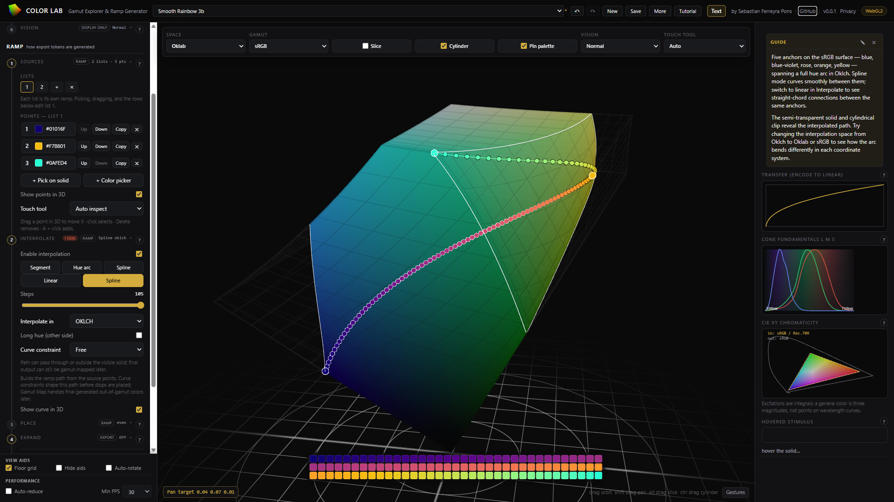

# COLOR LAB frontend

SvelteKit 5 + TypeScript frontend for **COLOR LAB — Gamut Explorer**.

**Live site:** [colorlab.ferreyrapons.com](https://colorlab.ferreyrapons.com)



## Stack

- [SvelteKit 2](https://svelte.dev/docs/kit) with Svelte 5 runes
- [adapter-node](https://svelte.dev/docs/kit/adapter-node) for production SSR
- WebGL2 renderer with GLSL shaders (`glslify` via local Vite plugin)
- Vitest for unit tests

## Scripts

| Command | Description |
|---------|-------------|
| `npm run dev` | Start Vite dev server |
| `npm run build` | Production build (`fe/build/`) |
| `npm start` | Run built Node server (`node build`) |
| `npm run preview` | Preview production build locally |
| `npm run check` | Type-check with `svelte-check` |
| `npm test` | Run Vitest |

## Development

```sh
npm install
npm run dev
```

Optional: copy `.env.example` to `.env` for local configuration (see below).

## Environment variables

`vite.config.ts` sets `envPrefix: ['VITE_', 'PUBLIC_']`, so `PUBLIC_*` variables are inlined at **build time**.

| Variable | Purpose |
|----------|---------|
| `PUBLIC_SITE_URL` | Public canonical origin for social preview metadata |
| `PUBLIC_UMAMI_SRC` | Umami tracker script URL |
| `PUBLIC_UMAMI_WEBSITE_ID` | Umami website ID |

Set `PUBLIC_SITE_URL` to the production origin (e.g. `https://colorlab.ferreyrapons.com`) so social preview image URLs are absolute and canonical. Set **both** Umami variables to enable cookieless analytics; leave them unset for zero tracking. See [`.env.example`](.env.example).

```sh
PUBLIC_SITE_URL=https://colorlab.ferreyrapons.com \
PUBLIC_UMAMI_SRC=https://umami.example.com/script.js \
PUBLIC_UMAMI_WEBSITE_ID=<uuid> \
npm run build
```

## Production build and run

```sh
npm run build
npm start
```

The Node server listens on `PORT` (default `3000`) and `HOST` (default `0.0.0.0`). Set `ORIGIN` or `PUBLIC_SITE_URL` to the public URL (production: `https://colorlab.ferreyrapons.com`) when deploying behind a reverse proxy so SSR social preview tags do not point at the internal upstream.

### PM2

From the repo root:

```sh
cd fe && npm run build
pm2 start ../ecosystem.config.cjs
```

[`ecosystem.config.cjs`](../ecosystem.config.cjs) runs `fe/build/index.js` on port `5001`.

## Project structure

```
src/
  routes/           SvelteKit pages and root layout
  lib/
    analytics/      Umami injection and event tracking
    color/          Color math, matrices, transfer functions
    components/     UI shell, viewport, controls, inspector
    documents/      Parameter-set persistence (localStorage)
    engine/         Application state, picking, theme ramp logic
    inspector/      Right-panel help copy and headers
    panels/         2D canvas instruments (transfer, cones, xy, spectrum)
    renderer/       WebGL2 setup, shaders, draw loop
static/             PWA manifest, icons, robots.txt
```

## Features

- **3D gamut explorer** — instanced WebGL2 solids for sRGB, P3, Rec.2020, NTSC, and more
- **Arbitrary slice planes** — vertex-shader flattening with analytic ray picking
- **Inspector panels** — OETF curve, cone fundamentals, CIE xy chromaticity, spectrum
- **Theme ramp designer** — Oklab segment/arc/spread modes, sRGB fitting, WCAG AA, CSS/DTCG export
- **Documents** — named parameter sets stored in browser `localStorage`
- **PWA metadata** — `manifest.webmanifest`, favicon, and app icons in `static/`

## Privacy

Saved parameter sets stay in the browser. If Umami analytics are enabled at build time, the app collects anonymous usage events (no document names, color values, or exported tokens). See the in-app Privacy panel.

## License

MIT — see [../LICENSE](../LICENSE).
